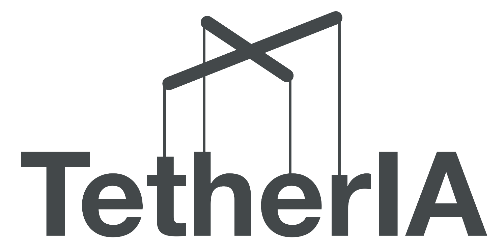
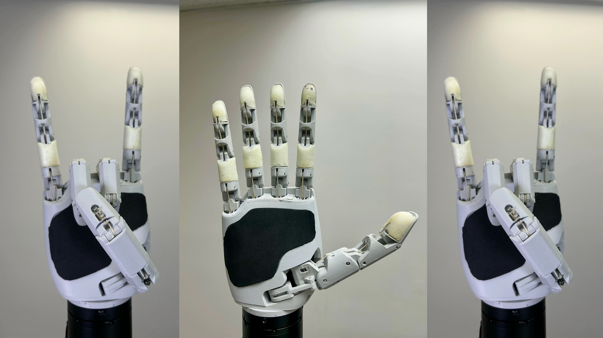

<p align="center">
  
  <br/><br/>
</p>

<div align="center">

[](https://www.python.org/downloads/)
[](https://pypi.org/project/aero-hand-sdk/)
[](LICENSE)
[](https://pypi.org/project/aero-hand-sdk/)
[](https://github.com/TetherIA/aero-open-sdk/actions)
[](https://tetheria.ai)

</div>

<h2 align="center">
  <p>Aero Hand SDK — Python Interface for TetherIA's Robotic Hand</p>
</h2>

<div align="center">
  
  <p><strong>Aero Hand Open</strong> is a 7-DoF tendon-driven robotic hand for dexterous manipulation and research.</p>
  <p>The SDK enables full control via Python. Perform homing, calibration, and precise motion control with ease.</p>
</div>

---

## ⚙️ Installation

The SDK is currently tested for Python 3.10 and above.

### 📦 Install via pip

```bash
pip install aero-hand-sdk
```

### 🧩 Install from source (editable mode)

1. Clone the repository to your local machine:
   ```bash
   git clone https://github.com/TetherIA/aero-open-sdk.git
   ```

2. Navigate to the cloned repository directory:
   ```bash
   cd aero-open-sdk
   ```

3. Install the package in editable mode:
   ```bash
   pip install -e .
   ```

---

## 🖥️ One-Time Setup

When setting up your hand for the first time, our setup GUI helps you configure motor IDs and test motor connections.

After installation, launch the Setup GUI with:

```bash
aero-hand-gui
```

This provides an interactive interface to configure your hand.

---

## 🔌 Serial Port Setup

Aero Hand connects to the host PC via a serial (USB) interface.
To operate the SDK, you must specify the correct serial port for your device.

### 🐧 Linux

Most Linux systems assign the device path as `/dev/ttyACM0` or `/dev/ttyUSB0`. You can list connected serial devices with:

```bash
ls /dev/ttyACM* /dev/ttyUSB*
```

**💡 Persistent Device Path (Recommended)**

Device names like `/dev/ttyUSB0` can change each time you reconnect.

To get a persistent name, use the by-id symlink instead:

```bash
ls -l /dev/serial/by-id/
```

This will show you a list of connected serial devices with more descriptive names. Look for the one that corresponds to your Aero Hand. Which will look something like:
```bash
usb-Espressif_USB_JTAG_serial_debug_unit_D8:3B:DA:45:C8:1C-if00
```
Then initialize your hand using that path:
```python
from aero_open_sdk.aero_hand import AeroHand

aero_hand = AeroHand(
  port="/dev/serial/by-id/usb-Espressif_USB_JTAG_serial_debug_unit_D8:3B:DA:45:C8:1C-if00"
)
```
✅ This ensures your connection always points to the correct device, even if you unplug and replug the hand or change the USB port.

### 🪟 Windows
On Windows, the device will appear as a COM port like `COM3` or `COM4`. You can find the correct COM port by checking the Device Manager under "Ports (COM & LPT)".

You can then Initialize your hand with the detected COM port:
```python
from aero_open_sdk.aero_hand import AeroHand
aero_hand = AeroHand(port="COM3")
```
**💡 Making the COM Port Persistent**

Windows does not have a /by-id/ system like Linux, so the COM number can change if you plug the device into a different USB port.

To make it permanent, you can assign a fixed COM number:
1. Plug in the Aero Hand and open Device Manager.
2. Find it under Ports (COM & LPT).
3. Right-click → Properties → Port Settings → Advanced.
4. In COM Port Number, select an unused port (e.g., COM5).
5. Click OK to save.

You can now always use this COM port when initializing the SDK.

---


## 💡 Examples

To integrate the SDK into your own code, refer to the `examples` folder for sample files demonstrating basic usage.

---

## 🧰 Troubleshooting

### 1. Installation Fails (`pip install` error)

If installation fails, try the following steps:

- Check your Python version:

    Make sure you have Python 3.10 or higher installed.

- 🔧 Upgrade pip to the latest version:

    Our package requires an up-to-date version of pip.

    You can upgrade pip with:
    ```bash
    pip install --upgrade pip
    ```

On Windows, if you see error like "pip is not recognized", use the `py` launcher command instead:

    ```bash
    py -m pip install --upgrade pip
    ```

### 2. Path Mismatch on Windows

- You may not have the Python Scripts path added to your system PATH environment variable.

- To fix this, you can either:

  1. Add the Python Scripts directory (e.g., `C:\Users\<YourName>\AppData\Local\Programs\Python\Python310\Scripts`) to your system PATH.
  2. Or use the `py` launcher command to launch the GUI directly:
      ```bash
      py -m aero_open_sdk
      ```

## 💬 Support

If you encounter issues or have feature requests:
- Open a [GitHub Issue](https://github.com/TetherIA/aero-open-sdk/issues)
- Contact us at **contact@tetheria.ai**

---

## 🤝 Contribution

We welcome community contributions!

If you'd like to improve the SDK, fix bugs, or add new features:

1. Fork this repository.
2. Create a new branch for your changes.
    ```bash
    git checkout -b feature/your-feature-name
    ```

3. Commit your changes with clear messages.

4. Push your branch to your fork.

5. Open a Pull Request (PR) describing your updates.


---

## ⚖️ License

This project is licensed under the **Apache License 2.0**.


<div align="center">
If you find this project useful, please give it a star! ⭐

Built with ❤️ by TetherIA.ai
</div>