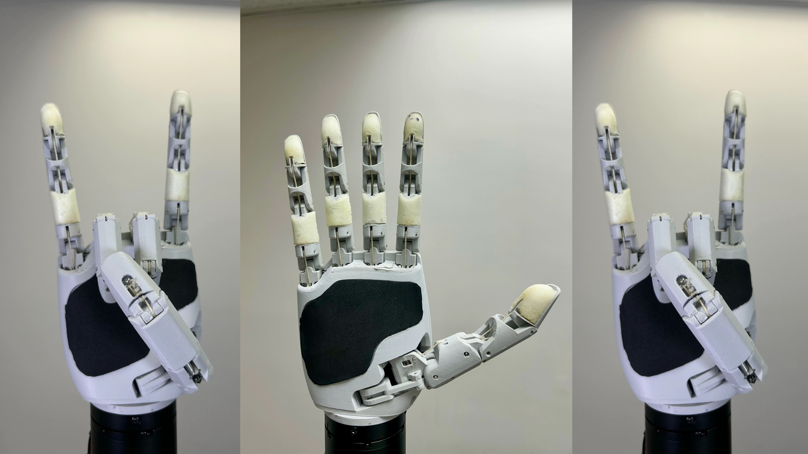

<p align="center">
  
  <br/><br/>
</p>

<div align="center">

[](https://www.python.org/downloads/)
[](https://pypi.org/project/aero-hand-sdk/)
[](LICENSE)
[](https://pypi.org/project/aero-hand-sdk/)
[](https://github.com/TetherIA/aero-open-sdk/actions)
[](https://tetheria.ai)

</div>

<h2 align="center">
  <p>Aero Hand SDK — Python Interface for TetherIA's Robotic Hand</p>
</h2>

<div align="center">
  
  <p><strong>Aero Hand Open</strong> is a 7-DoF tendon-driven robotic hand for dexterous manipulation and research.</p>
  <p>The SDK enables full control via Python. Perform homing, calibration, and precise motion control with ease.</p>
</div>

---

## ⚙️ Installation

The SDK is currently tested for Python 3.10 and above.

### 📦 Install via pip

```bash
pip install aero-hand-sdk
```

### 🧩 Install from source (editable mode)

1. Clone the repository to your local machine:
   ```bash
   git clone https://github.com/TetherIA/aero-open-sdk.git
   ```

2. Navigate to the cloned repository directory:
   ```bash
   cd aero-open-sdk
   ```

3. Install the package in editable mode:
   ```bash
   pip install -e .
   ```

---

## 🖥️ One-Time Setup

When setting up your hand for the first time, our setup GUI helps you configure motor IDs and test motor connections.

After installation, launch the Setup GUI with:

```bash
aero-hand-gui
```

This provides an interactive interface to configure your hand.

---

## 💡 Examples

To integrate the SDK into your own code, refer to the `examples` folder for sample files demonstrating basic usage.

---

## 🧰 Troubleshooting

For common issues and solutions, please refer to our troubleshooting guide (coming soon).

---

## 💬 Support

If you encounter issues or have feature requests:
- Open a [GitHub Issue](https://github.com/TetherIA/aero-open-sdk/issues)
- Contact us at **contact@tetheria.ai**

---

## 🤝 Contribution

We welcome community contributions!

If you'd like to improve the SDK, fix bugs, or add new features:

1. Fork this repository.
2. Create a new branch for your changes.
    ```bash
    git checkout -b feature/your-feature-name
    ```

3. Commit your changes with clear messages.

4. Push your branch to your fork.

5. Open a Pull Request (PR) describing your updates.


---

## ⚖️ License

This project is licensed under the **Apache License 2.0**.


<div align="center">
If you find this project useful, please give it a star! ⭐

Built with ❤️ by TetherIA.ai
</div>